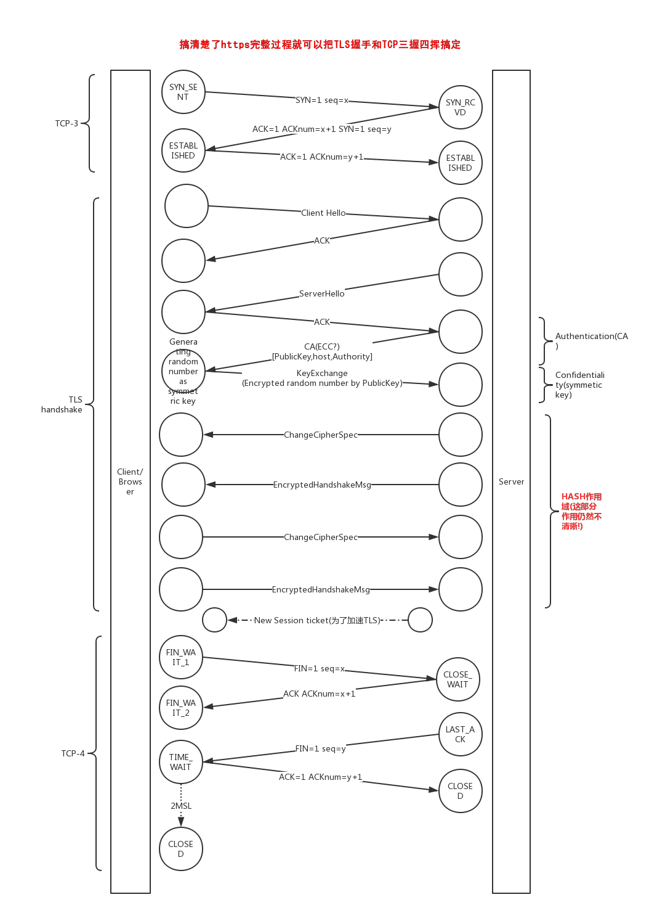

# 前言

之前准备了下面试，发现网络这块几乎都会问http过程,tcp握手过程以及https中的ssl/tls过程，最近随着http2的普及，http2也成为了必问的内容之一，原来不清楚https这块，所以就去学习了一下，发现其实光是https就这一个过程就可以囊括http,tcp三握四挥，ssl/tls加密验证这些知识点，现在来总结一下这一块的内容

# tcp三握四挥手
tcp跟http，ssl/tls，SPDY和http2这些不同层，这些都是属于应用层，而tcp是应用层的下一层:运输层，所以应用层的这些协议最后都会走tcp

# https
说https，强调的主要是ssl/tls，其中tls是新一代的ssl，可以这么理解

# http2  
要说http2之前，首先要说说SPDY(speedy缩写)，因为http2就是从SPDY改进来的(SPDY is jumping-off point of http2)，SPDY是Google的产物，为了减少网络传输延迟而开发的协议，相比http1.1本质上是在tcp和http之间加了一层SPDY层，这一层把原本http1.1文本传输变为了二进制帧，这一改进是其他新特性的基础

SPDY相对于http1.1的新特性:  
1.无需FIFO的多路复用(Multiplexing):  
一个TCP连接就可以处理所有的请求;  
2.二进制分帧:  
将一个TCP连接分成若干个流(Stream)，每个流又分为若干消息(Message)，而每个消息又分为若干帧(Frame)，每一个SPDY用户都会被分配一个stream ID代表用户和服务器之间只有一个TCP连接
3.强制压缩(包括headers);  
4.优先级排序(Priority);  
5.双向通讯;  
6.服务器推送;  

而从SPDY到http2的话，最显著的就是头部压缩算法的改变，从dynamic stream-based compression algorithm到fixed huffman code-based compression algorithm，为了防止Compression oracle attack而做的改进，可以说是安全性的改进  

值得注意的是，虽然http2在协议上没有要求https，但是在SPDY时代，就已经默认使用https，所以现实中Chrome,Firefox等主流的浏览器一般都是默认http2必须要在ssl/tls上
